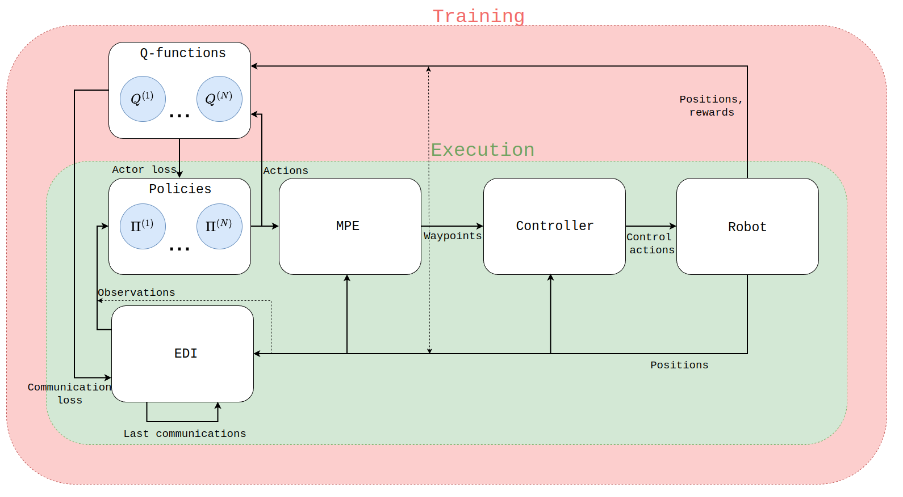
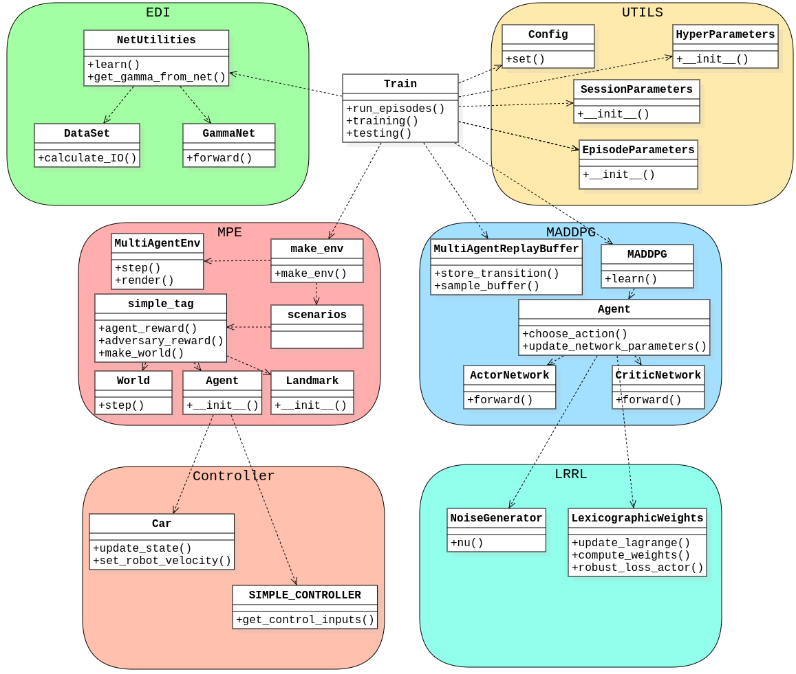

# Thesis

## Table of Contents
- [Project Description](#project-description)
    - [Report Abstract](#report-abstract)
- [Environments and Experiments](#environments-and-experiments)
    - [Environment A](#environment-a)
    - [Environment B](#environment-b)
    - [Environment C](#environment-c)
- [Installation and Running Instructions](#installation-and-running-instructions)
    - [Requirements](#requirements)
    - [Running](#running)
    - [Reproducing Results](#reproducing-results)
- [Software Architecture](#software-architecture)
    - [Flowchart](#flowchart)
    - [Simplified Class Diagram](#simplified-class-diagram)
- [Credits](#credits)


## Project Description
This is the repository of my graduation project with the topic of reducing the communication in a multi-agent reinforcement learning system by exploiting observational robustness. The accompanying report can be found [here](Thesis.pdf) and contains all the technical details for the interested reader. It combines two ideas by Daniel Jarne Ornia, namely increasing the observational robustness in a reinforcement learning system given [here](), and trading observational robustness for reducing communication between agents in a multi-agen reinforcement learning system given [here](). 

### Report Abstract


## Environments and Experiments 
We tested 3 environments in our experiments. For all environments we included a recording of the execution.

### Environment A
The first is a slightly adapted version of the simple_tag environment from the [MPE](https://github.com/openai/multiagent-particle-envs) environments. We adapted it so that one of the adversaries is supposed to mirror the movements of the other adversary. 

<video src="simple-tag.mp4" controls title="Title"></video>

### Environment B
The second environment uses the first environment to generate waypoints, and then uses the differential drive dynamics from [here](https://github.com/zainkhan-afk/Differential-Drive-Robot-Navigation) together with a very simple low level controller to determine its control inputs.

<video src="simple-tag-mpc.mp4" controls title="Title"></video>

### Environment C
The third environment uses the first environment to generate waypoints, and the same low level controller from the second environment, but then puts these control inputs into the [webots simulator](https://cyberbotics.com/) for more realistic robot dynamics. The robot model used in these simulations is the [Elisa-3](https://www.gctronic.com/doc/index.php/Elisa-3) robot by GCtronic.

<video src="simple-tag-webots.mp4" controls title="Title"></video>

## Installation and Running Instructions
I have developed this code on an Ubuntu 20.04.6 LTS machine, using python 3.8.10 in Visual Studio Code and running from the terminal.  

### Requirements
Clone the repository and navigate to it's parent folder. Create a virtual environment 

```
pip install virtualenv
python -m venv environment
source environment/bin/activate
pip install -r requirements.txt
```

This will have installed all necessary python libraries. For tests in webots, it will also be necessary to install this separately from their [website](https://cyberbotics.com/). 


### Running 
You can now navigate into the repository and run the [main](main.py) script. 

```
cd repository_folder
python main.py
```

For running the webots environments, navigate to the repository folder and run with the virtual environment activated:

```
cd elisa/worlds
webots elisa3.wbt
```

For generating plots, navigate to the repository folder and run the [plots](plots.py) script:

```
python plots.py
```

For all scripts, make sure to select the right settings and environment. Also make sure to set the hyperparameters in [utils.py](utils.py).


### Reproducing Results
There are pre-trained networks available for all environments for the MADDPG algorithm and the robustness surrogates networks. Make sure to select the right settings in the [main](main.py) script to get the results of interest. Do the same for the [plots](plots.py) script. All the pickle files used to generate the plots seen in the [report](Thesis.pdf) are in the [results](results) folder if you want to recreate them directly.

> Please note that running the full [main](main.py) script, and training the networks from scratch can take up to 3 days.

> The branch edi_particle_tag_old_rewards, which is used to generate figure 3-3 in the [report](Thesis.pdf), is not currently working with the virtual environments, since this branch was developed on an older version of pytorch.


## Software Architecture
Since this has become quite a large repository, I want to take some time to discuss the architecture of it.

### Flowchart
First of all, here is a flowchart of the algorithms and the inforation flows between them during training and execution. The policies will decide actions based on observations, which are used to update the Multi-Particle Environments (MPE) environment. In environment A, the output of the MPE environment, such as the positions and the rewards, is
used directly, as indicated by the dotted line. In environments B and C, the positions determined by the MPE environment are merely used as waypoints by the controller, which determines the robot’s control action. This is either the linear and angular velocity for the Python robot model, or the wheel rotational speeds for the Webots implementation. Then the robot position is updated, and these positions are used by most other blocks. Suppose Event-Driven Interactions
(EDI) mode is activated. In that case, these positions will be adjusted to incorporate the last communications by the agents, and then the resulting observations will be the following input for
the policy block. If EDI mode is not activated, and periodic communication is employed, the EDI block is replaced by the dotted line and the positions are used directly.

It can also be seen that the Q-functions are only available during training, and not during execution. We need Q-values to train the neural networks for the policies and the robustness surrogate.



### Simplified Class Diagram
Here is a simplified class diagram to visualise how the used classes relate to one another. Since there are so many classes, I only put the most essential functions as attributes.



## Credits
Not all code in this repository is written by myself, though all the code in the parent folder is original.

The [MADDPG](MADDPG) algorithm is originally from Phil Tabor's [implementation](https://github.com/philtabor/Multi-Agent-Deep-Deterministic-Policy-Gradients). I made minor adjustments to suit my needs, and I added the option of lexicographically adding in the robustness loss in [maddpg](MADDPG/maddpg.py).

The MADDPG [implementation](https://github.com/philtabor/Multi-Agent-Deep-Deterministic-Policy-Gradients) uses the [Multiple Particle Environment](https://github.com/openai/multiagent-particle-envs), which I also used for my implementation. I made some slight alterations in the [scenario](MPE/multiagent/scenarios/simple_tag.py), mainly the reward function and in the [core](MPE/multiagent/core.py) and [environment](MPE/multiagent/environment.py) files to accomodate the dynamics and kinematics in the B and C environments.

This is the [robot model](https://github.com/zainkhan-afk/Differential-Drive-Robot-Navigation) for differential drive robots that I used. I altered the [car](MPC/car.py) script to suit our dimensions and to have the option to read out the cartesian velocity. [This](https://github.com/zainkhan-afk/Differential-Drive-Robot-Navigation) repository also included some controllers, which I did not end up using. I added my own SIMPLE_CONTROLLER in [controller](MPC/controller.py), which is what was used in the end.

The repositorys for [LRRL](https://github.com/danieljarne/LRRL) and [EDI](https://github.com/danieljarne/Event-Driven-MARL) by Daniel Jarne Ornia, which formed the inspiration for this project need to be mentioned. The adjustments that I had to make to the [EDI](EDI) method were large enough that I wrote my own code, but most of the work in [LRRL](LRRL) comes from [Daniel's repository](https://github.com/danieljarne/LRRL).

I want to thank Daniel Jarne Ornia himself as well, since he helped a lot on this project, both to understand his work and to spar with me for my own adaptations of his work.

